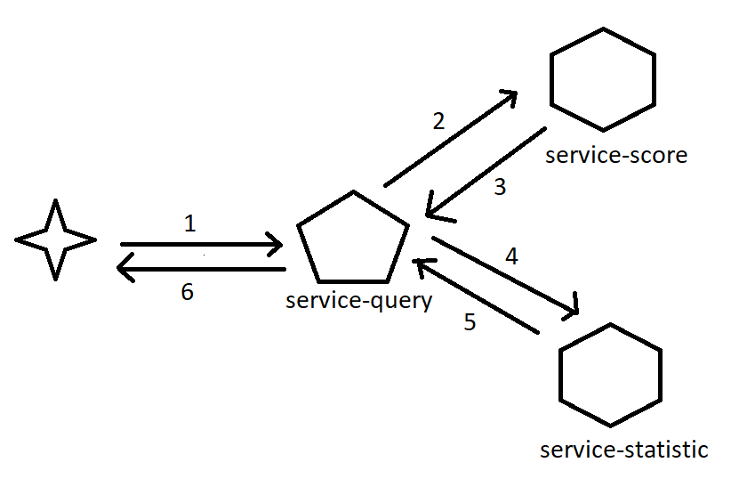

# Training

Query Score

### Arquitectura

- service-score
    - query db (posgrest)
    - db table score
        + id
        + score
    - capacidad de busqueda de varios score al mismo tiempo

- service-statistic
    - save information
    - save db (posgrest)
- 
- service-query
    - exponer los endpoint de colsulta de score
    - el cliente consulta id_cliente
    - orquestador logica

ltespinosa2020@gmail.com

maide8901@gmail.com

castellanoivian@gmail.com